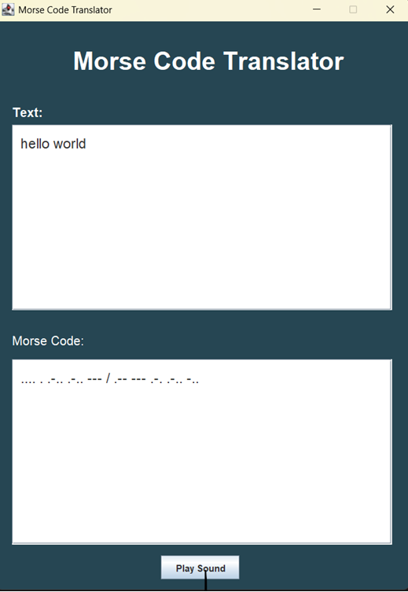

# Morse Code Translator GUI

A Java Swing desktop application that translates text into Morse code and plays audible beeps for dots and dashes.  
This project demonstrates GUI programming, event-driven logic, and audio playback using the Java Sound API.

---

## ✨ Features
- Text → Morse translation (type any text and instantly see the Morse code equivalent)
- Real-time updates (translation updates automatically as you type)
- Sound playback (play Morse code as short and long beeps)
- User-friendly GUI (styled interface with text areas, labels, buttons, and scroll panes)

---

## 📂 Project Structure
```
morse-code-translator-gui/
 ├── src/
 │    ├── App.java                   # Entry point with main()
 │    ├── MorseCodeTranslatorGUI.java # GUI window
 │    └── MorseCodeController.java    # Translation + sound logic
 ├── images/
 │    └── gui.png                     # Screenshot of the GUI
 ├── README.md
 └── LICENSE
```

---

## 🚀 How to Run
1. Clone the repository:
   ```bash
   git clone https://github.com/yourusername/morse-code-translator-gui.git
   cd morse-code-translator-gui/src
   ```

2. Compile the source files:
   ```bash
   javac App.java MorseCodeTranslatorGUI.java MorseCodeController.java
   ```

3. Run the application:
   ```bash
   java App
   ```

---

## 🎯 Learning Outcomes
This project covers several important Java concepts:
- Swing GUI programming (creating windows, labels, text areas, buttons, and layouts)
- Event handling (using `ActionListener` and `KeyListener` to respond to user actions)
- Data structures (`HashMap` to store character-to-Morse mappings)
- String manipulation (converting text into Morse code patterns)
- Java Sound API (generating audio tones for dots and dashes)
- Multithreading (running sound playback in a separate thread to keep the GUI responsive)
- MVC design pattern (separating the GUI, logic, and entry point)

---

## 📸 Screenshots

Here’s how the Morse Code Translator GUI looks:


---

## 🔮 Future Improvements
- Add reverse translation (Morse → Text)
- Export Morse sound to `.wav` file
- Improve GUI styling with themes

---

## 📜 License
This project is licensed under the MIT License – see the LICENSE file for details.
```

---

